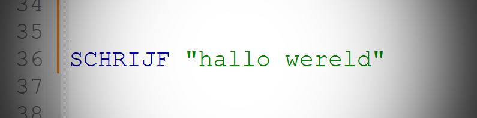

## A Dutch syntax scripting language made completely in Python
I started this little project to gain more knowledge about python and how interpreted languages work.
At first, I started this project as a joke, but I went on and actually created a simple yet very cool interpreter
that you can use to create small scripts in Neprota.

This repository comes with a file which you can use in [NotePad++](https://notepad-plus-plus.org/downloads/) to get the correct syntax colors, 
and it will soon be equipped with a full guide as to how scripting in Neprota works. This project is far from 
finish though and I expect to make some major updates with loads of new features.

**_note: It can be very useful to know some words in Dutch_**

>As already made clear  in the [license](LICENSE.txt), I am not liable for any of the 
damages that may occure when using this project. This project has code that if not handled with care
may damage your files or OS. Please be cautious and don't change anything you don't know of.